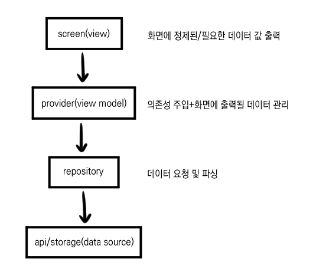

# 2026년 10월 이든크루 Flutter 과제 전형-박승연

## 실행 방법
```
Flutter 버전: 3.47.5
jdk 버전: 17
```
- 실행 명령어: `flutter run -d <에뮬레이터 디바이스 ID>`
- 확인한 플랫폼과 기기: `플랫폼-안드로이드/기기-Pixel 7 API 37.2` 웹으로 확인할 경우 API가 동작하지 않습니다.
- 폰트 처리 방식: `app_theme.dart` 기본 폰트 설정을 그대로 뒀습니다.

## 구현 범위
- 필수 항목 중 완료한 것 / 남은 것

    과제1의 필수 항목은 모두 구현 완료했습니다. 목록은 정리용으로 붙여둡니다.

    1. 관심 화면
        - 관심종목 각 행에 종목명, 종목코드 및 시장, 현재가, 전일 대비 등락액과 등락률 표시
        - 등락에 따른 색상 반영(상승, 하락, 보합) 처리
        - 새로고침 버튼을 누르면 시세를 다시 조회
        - 하단 탭 바로 관심/검색 화면 전환
        - 시세를 받지 못한 행은 스켈레톤 상태로 표시
        - 관심종목이 하나도 없을 때 빈 상태 표시
        - 정렬 기능
    2. 검색 화면
        - 검색 입력창 및 전체 지우기 동작
        - 검색 결과(종목명, 종목코드 및 시장, 관심 등록 버튼) 표시
        - 별 아이콘을 통해 관심 등록/해제 즉시 반영
        - 등록/해제시 화면 하단에 토스트 표시
        - 행 클릭으로 상세 화면 이동
        - 검색 초기 상태 표시
        - 검색 결과 없을 때 빈 상태 표시
    3. 종목 상세
        - 상단에 뒤로가기, 종목명, 종목코드, 시장, 관심 등록 버튼(관심 등록/해제 동작 가능) 표시
        - 현재가와 전일 대비 등락 표시
        - 기간 탭 동작(그래프, 일별 시세 모두 변경)
        - 캔들 차트 표시(상승/하락 색상 적용)
        - 요약 카드 표시(거래량 및 시가총액 축약)
        - 일별 시세 표시
    4. 상태 동기화
        - 관심 상태 동기화(별 아이콘 변경, 관심-검색-상세 화면의 관심 결과 일치)

- 추가로 구현한 선택 항목
    - 검색 화면: 검색어 입력 중 로딩 표시(정확하겐 결과를 받아오는 동안 loading 표시)
    - 검색 화면: 토스트 등장/퇴장 애니메이션 적용

- 테스트 미작성

## 기술 선택과 이유
- 상태관리, 폴더 구조, 아키텍처 패턴

    FSD와 비슷한 패턴(Feature-based) 패턴이 있어 참고. 도메인별로 구분하고 공통으로 쓰이는 것은 common에 배치.<br>
    그 외론 다음과 같은 구조로 아키텍처 구성.
    
    ```
    lib/
    ├── common/ 여러 곳에서 재사용될 위젯, 리소스
    │   ├── data/
    │   │   ├── api/
    │   │   ├── dto/
    │   │   ├── model/ 
    │   │   ├── provider/
    │   │   └── storage/
    │   └── widgets/
    ├── features/ 도메인별 구성
    │   └── watch/ 도메인 이름 ex)watch, search
    │       ├── data/
    │       │   ├── model/ 가공된 데이터 양식
    │       │   └── repository/
    │       ├── presentation/ 화면 및 위젯
    │       │   └── providers/
    │       └── ...
    └── main.dart
    ```
    - api가 common에 모여있어 dto도 일단 모아두었습니다.
    - wish의 경우 전체적으로 쓰여 common으로 빼두었습니다.

- 주요 패키지
    - shared_preferences
    - provider
    - http
    - intl
    - syncfusion_flutter_charts

- 차트 처리 방식 (패키지 / CustomPainter)

    `syncfusion_flutter_charts` 사용. (CustomPainer로 제작할 시간을 아끼고자 함.)

- 디자인 토큰을 추가 이유

    empty 화면에 적용할 아이콘 크기가 없어 iconLg 토큰을 추가.

## 직접 판단한 부분과 이유
- 토스트 노출 시간과 사라지는 방식

    SnackBar 기본값인 애니메이션과 duration 적용했습니다. 별도의 요구사항이 없으므로 기본값이 적합하다고 판단했습니다.
- 로딩 / 네트워크 에러 / 긴 종목명 오버플로 처리

    api 결과 대기와 네트워크 에러처럼 사용자 입장에서 현재 상태를 명확하게 알아야 하는 부분을 위주로 처리했습니다. 별도의 오버플로 처리는 하지 않았습니다.
- 시세를 못 받은 행이 있을 때의 정렬 처리

    기본적으로 storage에 추가한 순서대로 나오나, 값이 도착하는대로 정렬이 되도록 구현했습니다. 가나다순의 경우 값을 받지 않아도 되기 때문에 메타데이터를 받는 즉시 정렬이 이루어집니다.
- Figma와 다르게 구현한 부분

    최대한 Figma의 디자인과 맞추려 했으나 다음의 항목에서 구현이 달라졌습니다.
    - icon 형태: 따로 아이콘을 받아 쓰지 않고 기본 material의 아이콘을 사용했습니다. icon은 쉽게 변경이 가능하여 이쪽에 많은 시간을 들이고 싶지 않았습니다.
    - 캔들차트 형태: 최대한 주어진 디자인에 맞추고 싶었으나 시간이 너무 오래 걸릴 것 같아 패키지 차트에 기간과 색상을 적용하는 식으로만 구현했습니다.

## 막혔던 지점과 어떻게 접근했는지
- 관심 탭을 눌렀다 검색으로 돌아가면 검색어 및 결과가 날아가는 문제
    - 기존의 body를 screens[index]로 교체하는 방식은 화면을 다시 만들어붙여 controller, state 등이 초기화됩니다.
    - `indexed stack`을 사용하여 화면을 트리에 유지하고 하나만 보여주게 하였습니다.
    <br><br>
- 검색어를 비웠을 때 initial 화면이 뜨지 않는 문제
    - 키워드가 없으면 initial 화면이 뜨도록 했는데 이렇게 해도 기존 검색 목록이 뜨는 문제가 있었습니다.
    - 삭제 과정에서 요청을 보낸 후 empty 처리가 이루어지는데, 그 뒤에 입력 결과가 도착하여 empty 처리가 취소되는 것을 확인했습니다.
    - search id를 저장해 현재 search id와 요청할 때의 search id가 같은 경우에만 결과를 반영하도록 처리하여 해결했습니다.
    <br><br>
- 실시간 가격 api가 한번에 도착하여 skeleton이 무용해지는 문제
    - 메타데이터를 먼저 받아와 화면에 반영하고, 실시간 데이터는 stream을 통해 받는대로 반영하게 하였습니다.
    <br><br>
- 관심 종목이 0개인 것은 반영되는데, 그 외 상황(관심 종목이 있는 상태에서 추가 및 삭제)에서 변경이 반영되지 않는 문제
    - wish provider가 변경되어도 watch provider는 변경되지 않아서 refresh 동작을 하지 않는 문제였습니다.
    - watch provider가 wish provider의 변경을 직접 감지해서 refresh 하도록 했습니다.